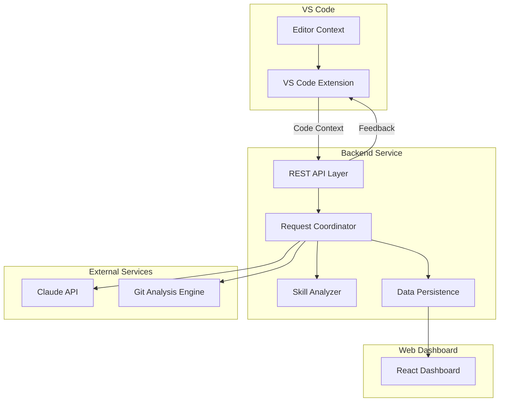

# Design Document: CodeMentor Live

## Overview

CodeMentor Live is an AI-powered pair programming assistant that teaches developers by predicting mistakes before they happen. The system consists of four main components:

1. **VS Code Extension** - Provides real-time feedback within the developer's editor
2. **Node.js Backend Service** - Coordinates AI requests, git analysis, and data persistence
3. **Claude API Integration** - Generates contextual explanations and predictions
4. **Git Analysis Engine** - Traces code history and extracts architectural decisions

The system follows a client-server architecture where the VS Code extension communicates with the backend service via REST API, and the backend orchestrates calls to Claude API and git analysis operations.

## Architecture



### Component Interaction Flow

1. Developer writes code in VS Code
2. Extension captures code context and sends to Backend Service
3. Backend Service analyzes context and determines appropriate action:
   - Mistake prediction → Claude API
   - Code storytelling → Git Analysis Engine + Claude API
   - Skill gap detection → Skill Analyzer + Claude API
4. Backend Service returns formatted response to Extension
5. Extension displays feedback inline or in sidebar
6. Progress data persists to database for Dashboard display

## Components and Interfaces

### VS Code Extension

**Responsibilities:**
- Capture editor events (code changes, selections, cursor position)
- Send code context to backend service
- Display feedback (inline decorations, hover tooltips, sidebar panels)
- Manage user interactions with predictions and challenges

**Key Interfaces:**

```typescript
interface CodeContext {
  filePath: string;
  language: string;
  selectedText?: string;
  cursorPosition: Position;
  surroundingLines: string[];
  projectRoot: string;
}

interface FeedbackResponse {
  type: 'prediction' | 'storytelling' | 'challenge';
  content: string;
  severity: 'info' | 'warning' | 'suggestion';
  position?: Range;
  actions?: Action[];
}

interface Action {
  label: string;
  command: string;
  args?: any[];
}
```

**Extension Activation:**
- Activates on workspace open
- Registers commands for manual triggers (storytelling, challenge request)
- Sets up event listeners for code changes

### Backend Service (Node.js)

**Responsibilities:**
- Expose REST API for extension communication
- Coordinate requests to Claude API and Git Analysis Engine
- Manage skill level assessment and tracking
- Persist developer progress and metrics
- Serve dashboard data

**API Endpoints:**

```typescript
// Mistake prediction
POST /api/predict
Body: { context: CodeContext, skillLevel: SkillLevel }
Response: { prediction: string, mentalModel: string, confidence: number }

// Codebase storytelling
POST /api/storytelling
Body: { context: CodeContext, selectedCode: string }
Response: { narrative: string, commits: Commit[], decisions: Decision[] }

// Skill gap analysis
POST /api/analyze-skill
Body: { codeSnippets: CodeSnippet[], userId: string }
Response: { weakConcepts: Concept[], challenges: Challenge[] }

// Progress tracking
GET /api/progress/:userId
Response: { timesSaved: number, conceptsMastered: Concept[], accuracy: number }

// Update progress
POST /api/progress/:userId
Body: { event: ProgressEvent }
Response: { success: boolean }
```

**Request Coordinator:**

```typescript
class RequestCoordinator {
  async handlePrediction(context: CodeContext, skillLevel: SkillLevel): Promise<Prediction> {
    // 1. Analyze code context for common mistake patterns
    // 2. Generate Claude API prompt with skill level
    // 3. Parse Claude response into prediction + mental model
    // 4. Return structured prediction
  }
  
  async handleStorytelling(context: CodeContext, selectedCode: string): Promise<Story> {
    // 1. Extract file path and line numbers
    // 2. Call Git Analysis Engine for history
    // 3. Send history + code to Claude for narrative generation
    // 4. Return structured story with commits and decisions
  }
  
  async handleSkillAnalysis(snippets: CodeSnippet[], userId: string): Promise<SkillReport> {
    // 1. Analyze code patterns using Skill Analyzer
    // 2. Identify weak concepts
    // 3. Generate challenges via Claude API
    // 4. Update user skill profile
    // 5. Return report with challenges
  }
}
```

### Claude API Integration

**Responsibilities:**
- Generate mistake predictions based on code context
- Create mental model explanations
- Synthesize git history into narratives
- Generate personalized learning challenges

**Prompt Templates:**

```typescript
interface PromptTemplate {
  mistakePrediction: (context: CodeContext, skillLevel: SkillLevel) => string;
  mentalModel: (mistake: string, context: CodeContext) => string;
  storytelling: (gitHistory: GitHistory, code: string) => string;
  challengeGeneration: (concept: Concept, skillLevel: SkillLevel) => string;
}
```

**Example Mistake Prediction Prompt:**
```
You are an expert programming mentor. Analyze the following code context:

Language: {language}
Code: {code}
Developer Skill Level: {skillLevel}

Identify the most likely mistake a {skillLevel} developer might make in this context.
Format your response as:
1. Prediction: What mistake might occur?
2. Question: Ask "What will happen if you do X?"
3. Mental Model: Explain the expert thinking pattern
```

### Git Analysis Engine

**Responsibilities:**
- Retrieve git history for specific code sections
- Parse commit messages for architectural decisions
- Identify authors and change patterns
- Construct chronological narratives

**Key Operations:**

```typescript
interface GitAnalysisEngine {
  getHistoryForLines(filePath: string, startLine: number, endLine: number): Promise<Commit[]>;
  extractDecisions(commits: Commit[]): Decision[];
  analyzeChangePatterns(commits: Commit[]): ChangePattern;
  buildNarrative(commits: Commit[], decisions: Decision[]): GitHistory;
}

interface Commit {
  hash: string;
  author: string;
  date: Date;
  message: string;
  diff: string;
}

interface Decision {
  type: 'architectural' | 'refactoring' | 'bugfix';
  description: string;
  rationale?: string;
  commit: string;
}

interface GitHistory {
  commits: Commit[];
  decisions: Decision[];
  timeline: TimelineEvent[];
}
```

**Implementation Approach:**
- Use `git blame` to identify commits affecting specific lines
- Use `git log -L` to get line-specific history
- Parse commit messages for keywords indicating decisions (e.g., "refactor", "redesign", "fix architecture")
- Use Claude API to extract rationale from commit messages

### Skill Analyzer

**Responsibilities:**
- Analyze code patterns to identify recurring issues
- Map issues to programming concepts
- Track concept mastery over time
- Adjust skill level based on performance

**Analysis Pipeline:**

```typescript
interface SkillAnalyzer {
  analyzeCodePatterns(code: string, language: string): Pattern[];
  mapPatternsToConceptsMap(patterns: Pattern[]): Map<Concept, Confidence>;
  identifyWeakConcepts(conceptMap: Map<Concept, Confidence>, threshold: number): Concept[];
  updateSkillProfile(userId: string, concepts: Concept[]): Promise<void>;
  assessSkillLevel(userId: string): Promise<SkillLevel>;
}

interface Pattern {
  type: string; // e.g., "missing-error-handling", "inefficient-loop"
  location: Range;
  severity: number;
}

interface Concept {
  id: string;
  name: string; // e.g., "Error Handling", "Async/Await"
  category: string; // e.g., "Control Flow", "Performance"
}

interface Confidence {
  score: number; // 0-1
  evidence: Pattern[];
}
```

**Concept Mapping Examples:**
- Missing try-catch → "Error Handling"
- Nested callbacks → "Async/Await" or "Promises"
- Inefficient loops → "Algorithm Complexity"
- Hardcoded values → "Configuration Management"

### Progress Dashboard

**Responsibilities:**
- Display learning metrics and trends
- Show completed challenges and mastered concepts
- Visualize mistake prediction accuracy
- Provide historical progress data

**Tech Stack:**
- React for UI components
- Tailwind CSS for styling
- Recharts for data visualization
- React Router for navigation

**Key Components:**

```typescript
interface DashboardProps {
  userId: string;
}

// Main dashboard view
function Dashboard({ userId }: DashboardProps) {
  // Displays overview metrics
}

// Metrics cards
function MetricsCard({ title, value, trend }: MetricsCardProps) {
  // Displays individual metric with trend indicator
}

// Concepts mastery chart
function ConceptsMasteryChart({ data }: ChartProps) {
  // Line chart showing concepts mastered per week
}

// Prediction accuracy gauge
function AccuracyGauge({ accuracy }: GaugeProps) {
  // Circular gauge showing prediction accuracy percentage
}
```

## Data Models

### User Profile

```typescript
interface UserProfile {
  id: string;
  skillLevel: 'junior' | 'mid-level';
  conceptMastery: Map<string, MasteryLevel>;
  totalChallengesCompleted: number;
  predictionAccuracy: number;
  createdAt: Date;
  lastActive: Date;
}

interface MasteryLevel {
  concept: Concept;
  level: number; // 0-5
  lastPracticed: Date;
  challengesCompleted: number;
}
```

### Progress Event

```typescript
interface ProgressEvent {
  userId: string;
  type: 'prediction_correct' | 'prediction_incorrect' | 'challenge_completed' | 'concept_practiced';
  timestamp: Date;
  metadata: {
    conceptId?: string;
    predictionId?: string;
    timeSaved?: number; // in minutes
  };
}
```

### Challenge

```typescript
interface Challenge {
  id: string;
  concept: Concept;
  difficulty: 'easy' | 'medium' | 'hard';
  description: string;
  starterCode: string;
  solution: string;
  hints: string[];
  testCases: TestCase[];
}

interface TestCase {
  input: any;
  expectedOutput: any;
  description: string;
}
```

### Prediction

```typescript
interface Prediction {
  id: string;
  userId: string;
  codeContext: CodeContext;
  predictedMistake: string;
  question: string;
  mentalModel: string;
  confidence: number;
  userResponse?: 'correct' | 'incorrect' | 'skipped';
  timestamp: Date;
}
```

## Correctness Properties

*A property is a characteristic or behavior that should hold true across all valid executions of a system—essentially, a formal statement about what the system should do. Properties serve as the bridge between human-readable specifications and machine-verifiable correctness guarantees.*

